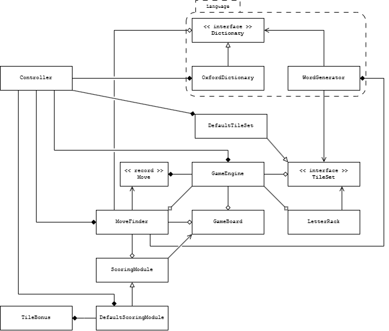

# WordCheat

WordCheat is a desktop helper for Words With Friends. You copy the board and your letters into it,
and it lists every move you can play, with the highest score first.

## Background

WordCheat exists because my mother always beats me at Words With Friends.

The save file the app opens on start-up is called `mom`, so the source makes no secret of who this
was built to beat.

## Requirements

- Java 17 or later
- Maven

Maven downloads JavaFX 21 along with the other dependencies. JavaFX has a separate build for each
operating system, and the `pom.xml` picks the one for the machine running Maven: Windows, macOS on
Intel or Apple silicon, or Linux on x64 or ARM.

## Running

Maven starts the app through the JavaFX plugin:

```
mvn javafx:run
```

The game is saved under the name `mom`. A `--save` argument keeps a separate game under another name,
made of letters, digits, hyphens and underscores:

```
mvn javafx:run -Djavafx.args="--save=dad"
```

## Building the Windows installer

The `installer` profile builds a Windows installer that brings its own Java, so the person installing
WordCheat needs nothing else. It needs the [WiX Toolset](https://wixtoolset.org) on the `PATH`:

```
mvn -Pinstaller clean package
```

The installer lands in `target/installer`. It installs for the current user without asking for
administrator rights, adds a Start menu entry, and offers a desktop shortcut. Running a newer
installer replaces the older version.

## Using WordCheat

The window shows three areas, with a row of buttons and a status line underneath:

| Area       | What it shows                                                                                |
|------------|----------------------------------------------------------------------------------------------|
| Board      | The 15 by 15 board, with the double and triple letter and word squares marked on it.         |
| Tile pool  | Every tile in the game, with a count of how many are neither on the board nor on your rack. |
| Rack       | Your seven letters.                                                                          |

You enter a game by dragging tiles out of the pool. Tiles dropped on the board copy the words already
played in the real game. Tiles dropped on the rack copy the letters you are holding. The pool counts
go down as you drag, so the pool also tells you which letters your opponent could still have. A tile
dragged since the last commit can be dragged again, back to the pool or rack or to another square.

A blank is the last tile in the pool. When you drop a blank on the board, WordCheat asks which letter
it stands for. The blank then shows that letter without a score. Cancelling the question sends the
blank back where it came from.

The four buttons then do the following:

| Button    | Action                                                                                               |
|-----------|------------------------------------------------------------------------------------------------------|
| Commit    | Saves the board and rack as they appear on screen, then starts looking for moves.                    |
| Best Move | Shows the highest scoring move on the board, with its tiles highlighted and taken off the rack.      |
| Next Move | Shows the next move down the list, going back to the first after the last.                          |
| Reset     | Puts the board and rack back to the last committed state, which clears any move being shown.         |

The status line describes the move being shown, such as `CATS for 12 points, across from row 8,
column 6`. A lowercase letter in a move is played with a blank. While WordCheat is looking for moves,
the status line says so and the two move buttons are greyed out. Most racks take under a second, and
a rack holding both blanks can take around ten.

Commit checks two things before it saves:

- A board or rack using more of a letter than the game has, even after counting the blanks that could
  stand in for it, is refused with a message naming the letter. The board stays on screen so you can
  correct it.
- A word that is not in WordCheat's word list gets a warning, and you choose whether to commit anyway.
  The word list is not the one Words With Friends uses, so a word the game accepted can still get this
  warning.

A turn usually goes like this:

1. Drag in the tiles your opponent played, and the tiles you drew, then press Commit.
2. Press Best Move, and Next Move to see the alternatives.
3. Play the move you like in the real game, show it again in WordCheat, and press Commit. The move
   stays on the board and its tiles leave your rack.

Each commit writes the game to `~/.wordcheat/saves/mom.json` in your home folder. The app loads that
file when it starts. As such, a game carries on from one session to the next, and you only drag in the
tiles played since the last turn. A save that cannot be read is renamed to `mom.json.bak`, and the app
starts a new game and tells you so.

## How moves are found

WordCheat checks words against a list of 168,556 English words, stored in
`src/main/resources/words/words_alpha.txt`. The search for a turn runs in three steps:

1. It looks at every stretch of squares along each row and column that touches a tile already on the
   board, and that has between one and seven empty squares.
2. It fills the empty squares with letters from your rack, keeping the tiles already there, and keeps
   each result that is a word in the list.
3. It keeps a placement only where every crossing word it forms is also in the list. Words already on
   the board are left unchecked.

Each move is scored with the Words With Friends letter values and bonus squares. Two word bonuses
under one word multiply each other, so a double word and a triple word give six times the letters. A
move that uses all seven tiles earns an extra 35 points. On an empty board, WordCheat only tries
placements that cross the centre square.

A blank tile scores nothing wherever it lands.

## Project layout

The code is split into packages under `com.slinky.wordcheat`:

| Package    | Contents                                                                              |
|------------|---------------------------------------------------------------------------------------|
| `model`    | The board, rack, tile pool, scoring and move search. `GameEngine` ties them together. |
| `language` | The word list and the generator that builds words from a set of letters.              |
| `view`     | The JavaFX board, pool, rack and tiles.                                               |
| `control`  | Wiring between the view and the model, including drag and drop.                       |
| `io`       | Saving and loading games as JSON, and loading fonts.                                  |
| `util`     | Helpers for matrices, permutations, board symmetry and colours.                       |

A class diagram of the whole project is in `uml/`:



## Tests

The tests use JUnit 5 and cover the model, the move search, saving and loading, the word generator
and the utilities:

```
mvn test
```
